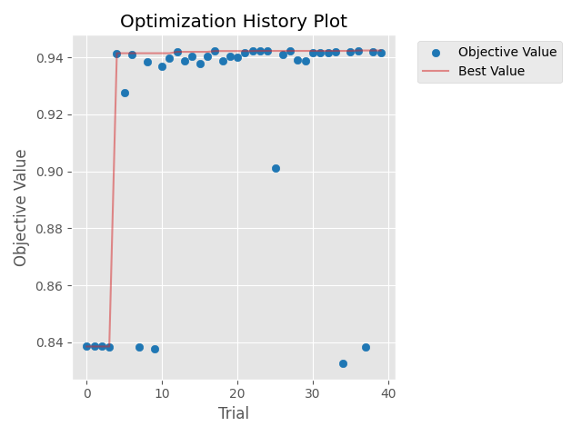
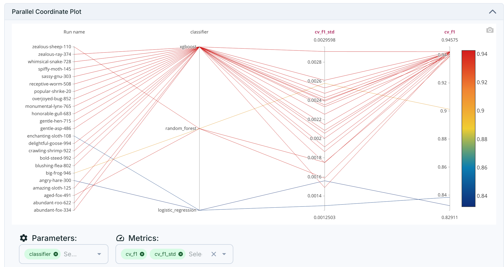
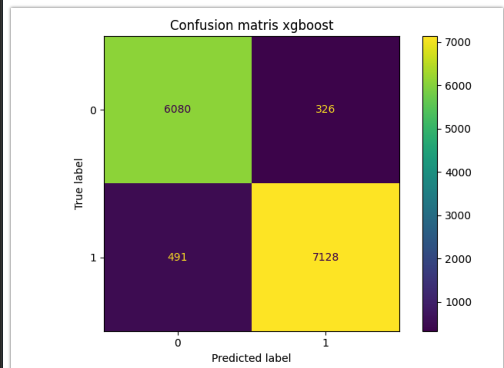
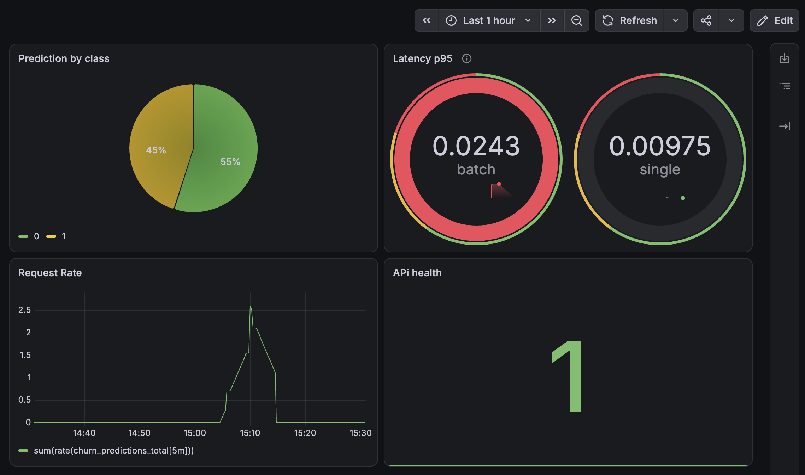

# ISP Customer Churn — End-to-End MLOps Pipeline

An end-to-end MLOps system for ISP customer churn prediction, covering data versioning, reproducible pipelines, experiment tracking, model serving, CI/CD, and production monitoring.

[](https://github.com/mohaiminul-git/ISP-chustomer-churn/actions)


## Why This Project

This project demonstrates an **end-to-end MLOps lifecycle** for a customer churn prediction system, covering data versioning, reproducible pipelines, experiment tracking, model optimization, deployment, CI/CD, and production monitoring.

The goal is to demonstrate how a machine learning model can be developed, deployed, and maintained as a reproducible and observable production system—not just trained and evaluated as an isolated model.

**Overview:** raw churn data is pulled from Kaggle and run through a DVC-versioned pipeline (ingest → validate → clean → engineer features → train), where Optuna tunes three model families under MLflow tracking, with the best-performing model registered and promoted to the champion alias. That model is served through a FastAPI app (single + batch prediction), containerized with Docker, instrumented with Prometheus, and visualized in Grafana. GitHub Actions retrains, rebuilds, health-checks, and — on a passing build — redeploys the whole stack to AWS EC2 automatically. Every stage is independently reproducible and versioned; nothing is a one-off manual step except the initial setup.

## Architecture

```
Raw data (Kaggle)
      │
      ▼
DVC pipeline: ingest → validate → clean → feature engineer → train
      │                                          │
      ▼                                          ▼
data/*.csv (versioned)              MLflow (experiment tracking,
                                      model registry, champion/challenger)
                                                  │
                                                  ▼
                                    FastAPI serving (single + batch prediction)
                                                  │
                                                  ▼
                        Docker Compose: API container + Prometheus + Grafana
                                                  │
                                                  ▼
                          GitHub Actions CI/CD → retrain → test → deploy to AWS EC2
```

## Key features

- **Versioned, reproducible pipeline** — DVC-tracked stages (`ingest → validate → clean → features → train`) defined in `dvc.yaml`, so every model is traceable back to the exact data and code that produced it.
- **Automated hyperparameter search** — Optuna-driven tuning across three candidate model families (Logistic Regression, Random Forest, XGBoost), evaluated with stratified k-fold cross-validation.
- **Champion/challenger model promotion** — a newly trained model is only promoted to serve production traffic if it beats the current champion's F1 score, tracked and aliased via the MLflow Model Registry.
- **REST API serving** — FastAPI app with both single-record and batch (CSV upload) prediction endpoints, request-validated with Pydantic schemas.
- **CI/CD** — every push retrains the model, rebuilds Docker images, runs an automated health check against the freshly built container, and (on `main`, only after that check passes) deploys to AWS EC2 over SSH.
- **Production monitoring** — the API is instrumented with Prometheus metrics (prediction counts by class, latency histograms) and visualized in a live Grafana dashboard, running alongside the API via Docker Compose.

## Tech stack

| Layer | Tools |
|---|---|
| Data versioning & pipeline | DVC |
| Modeling | scikit-learn, XGBoost, Optuna |
| Experiment tracking & registry | MLflow (via DagsHub) |
| Serving | FastAPI, Pydantic, Uvicorn |
| Monitoring | Prometheus, Grafana, `prometheus_client` |
| Containerization | Docker, Docker Compose |
| CI/CD | GitHub Actions, SSH-based deploy |
| Cloud | AWS EC2 |

## Model

Trained on the [Internet Service Churn dataset](https://www.kaggle.com/datasets/mehmetsabrikunt/internet-service-churn) (Kaggle) — subscription length, billing, usage, and service-failure features for ISP customers. Three model families are automatically tuned and compared on every training run:

- Logistic Regression
- Random Forest
- XGBoost

Each candidate is tuned with Optuna over 40 trials per model (see `param_config.yaml` for the search space) using 3-fold stratified cross-validation. The best-performing model by F1 is promoted as the "champion" in the MLflow Model Registry and served by the API — a new model only replaces it if it scores higher.

<p align="center">
  
  
</p>

XGBoost consistently outperformed Logistic Regression and Random Forest across trials (cross-validated F1 ≈ **0.946** vs. ≈ 0.83 for the weakest baseline) and was promoted as champion.

**Held-out test set results (XGBoost, champion model):**

| | precision | recall | f1-score | support |
|---|---|---|---|---|
| No churn (0) | 0.93 | 0.95 | 0.94 | 6,406 |
| Churn (1) | 0.96 | 0.94 | 0.95 | 7,619 |
| **Accuracy** | | | **0.94** | 14,025 |

<p align="center">
  
  
</p>

## Monitoring

The API exposes a `/metrics` endpoint (Prometheus text format) with custom instrumentation alongside default process/runtime metrics:

- `churn_predictions_total{endpoint, predicted_class}` — prediction volume, broken down by predicted class and endpoint (single vs. batch)
- `churn_prediction_latency_seconds{endpoint}` — prediction latency histogram

Scraped every 15 seconds by Prometheus and visualized in a Grafana dashboard with four panels: predictions by class, p95 latency, request rate, and API health (`up`).

`testing_dashboard_load.py` samples real records from the dataset and replays them against both endpoints — useful for generating realistic traffic to watch the dashboard update live. The dashboard definition itself is exported at [`grafana_dashboard/dashboard-1789560977838.json`](grafana_dashboard/dashboard-1789560977838.json) and can be re-imported into any Grafana instance pointed at the same Prometheus data source.



## CI/CD pipeline

On every push, GitHub Actions (`.github/workflows/ci.yaml`):

1. Installs dependencies (`uv sync`) and runs the test suite (`pytest`)
2. Builds the training image and runs it to retrain the model, committing the updated `dvc.lock`
3. Builds the inference (serving) image
4. Runs the inference container and polls `/health` until it responds, failing the pipeline if it doesn't come up
5. On `main` only, and only after the health check passes, SSHes into the EC2 instance, pulls the latest code, and redeploys with `docker compose up -d --build`

## Project structure

```
├── src/                    # Ingestion, cleaning, feature engineering, training, prediction
│   └── modeling/           # train.py (Optuna + MLflow), predict.py
├── api/                    # FastAPI app, routers, Prometheus metrics, request schemas
├── dvc.yaml                # Versioned pipeline stage definitions
├── param_config.yaml       # Model hyperparameter search space
├── compose.yml             # API + Prometheus + Grafana orchestration
├── prometheus.yml          # Prometheus scrape configuration
├── api.Dockerfile          # Serving image
├── train.Dockerfile        # Training image
├── testing_dashboard_load.py  # Sample-data load generator for the monitoring dashboard
├── grafana_dashboard/      # Exported Grafana dashboard JSON (importable)
├── .github/workflows/      # CI/CD pipeline
└── tests/                  # Unit tests
```

## Running it locally

Requires Docker, and a DagsHub account (for MLflow tracking) if you want to retrain.

```bash
git clone https://github.com/mohaiminul-git/ISP-chustomer-churn.git "Internet Service Provider Customer Churn"
cd "Internet Service Provider Customer Churn"
```

Create a `.env` file in the project root with:

```
DAGSHUB_USERNAME=<your dagshub username>
DAGSHUB_REPO_NAME=<your dagshub repo name>
DAGSHUB_USER_TOKEN=<your dagshub token>
MLFLOW_TRACKING_URI=<your mlflow tracking uri>
```

Then bring up the full stack:

```bash
docker compose up --build
```

- API docs: `http://localhost:8080/docs`
- Prometheus: `http://localhost:9090`
- Grafana: `http://localhost:3000` (default login `admin` / `admin` — change it)

Generate some traffic to watch the dashboard update:

```bash
uv run python testing_dashboard_load.py
```

## Running the pipeline directly

```bash
uv sync
uv run dvc repro   # runs ingest → validate → clean → features → train
```

## What I'd improve next

- **Data/concept drift detection** — compare production input distributions against the training data and trigger investigation when statistically significant drift is detected.
- **Deploying the exact image tested in CI** rather than rebuilding on the EC2 host from freshly pulled source — closing that gap would guarantee the bytes tested are the bytes running.
- **Separating the monitoring stack onto its own instance**, running Prometheus and Grafana independently from the application infrastructure would preserve observability if the application host or its Docker environment becomes unavailable.

## Demo

https://github.com/user-attachments/assets/a30ab5c6-d1bf-48ea-ac1f-0d9b78ad39cc

## License

MIT — see [LICENSE](LICENSE).
